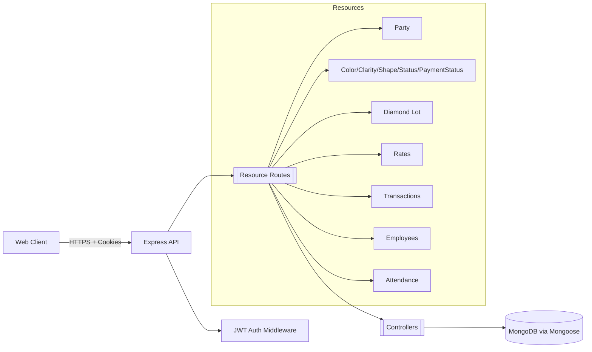

# Diamond Backend


## Overview

Diamond Backend is a RESTful API for managing diamond manufacturing
workflows. It provides secure authentication, master data management
(colors, clarity, shapes, status, parties), diamond lot tracking, rates,
transactions, employees, and attendance.

- Solves fragmented tracking across spreadsheets and manual ledgers.
- Centralizes operational entities with consistent validations.
- Enables analytics-ready data via clean schemas and pagination.

### Architecture



## Features

- Secure auth with HTTP-only, same-site `jwt` cookie.
- Master data: create, update, list, delete with pagination and search.
- Diamond lot creation with batch items and unique ID generation.
- Rates per party with value ranges and dated rate history.
- Transactions (Paid/Offset) with party linkage.
- Employee registry with attendance tracking (monthly views).
- Robust validation and error handling with consistent responses.
- CORS configured for local and deployed frontend origins.

## Technologies

| Category    | Technology        | Version   |
|------------|--------------------|-----------|
| Runtime    | Node.js            | >= 18     |
| Framework  | Express            | 5.1.0     |
| ORM        | Mongoose           | 8.20.1    |
| Auth       | jsonwebtoken       | 9.0.2     |
| Security   | bcryptjs           | 3.0.3     |
| Middleware | cookie-parser      | 1.4.7     |
| Middleware | cors               | 2.8.5     |
| Config     | dotenv             | 17.2.3    |
| Database   | MongoDB            | 6+        |
| Testing    | (none configured)  | n/a       |
| DevOps     | (none configured)  | n/a       |

## Installation

### Prerequisites

- Node.js >= 18 and npm.
- MongoDB instance (local or hosted).

### Setup (Local)

```bash
git clone https://github.com/LaxitSavaliya/diamond-backendall
```

Create `.env`:

```bash
MONGO_URI=mongodb://localhost:27017/diamond_db
JWT_SECRET_KEY=replace_with_a_long_random_secret
```

Run development server:

```bash
npm run dev
```

Run production server:

```bash
npm start
```

### Configuration

- `MONGO_URI`: Mongo connection string.
- `JWT_SECRET_KEY`: Secret for signing JWTs.
- CORS origins set in `src/index.js`.

### Database Init

- Collections and indexes are created on first use by Mongoose.
- No migrations are required currently.

## API Documentation

All responses follow:

```json
{
  "success": true,
  "message": "Description",
  "data": {}
}
```

Errors return `success: false` with appropriate `status` codes.

### Auth

- POST `/api/auth/signup`
  - Body:
    ```json
    { "userName": "string", "password": "string", "role": "Super Admin|Admin|Operator" }
    ```
  - Responses: 201, 400, 500
  - Sets `jwt` cookie.

- POST `/api/auth/login`
  - Body:
    ```json
    { "userName": "string", "password": "string" }
    ```
  - Responses: 201, 400, 500
  - Sets `jwt` cookie.

- POST `/api/auth/logout`
  - Clears `jwt` cookie. Responses: 200, 500

- GET `/api/auth/me` (auth required)
- GET `/api/auth/users` (auth required)

Usage examples:

```javascript
// Login
await fetch("/api/auth/login", {
  method: "POST",
  headers: { "Content-Type": "application/json" },
  credentials: "include",
  body: JSON.stringify({ userName: "admin", password: "secret123" })
});

// Get current user
await fetch("/api/auth/me", { credentials: "include" });
```

### Master Data

Resources: Color, Clarity, Shape, Status, PaymentStatus

- GET `/api/<resource>?page=1&search=&status=All|Active|Deactive`
- GET `/api/<resource>/all<PascalName>` (active only)
- POST `/api/<resource>`
  - Body: `{ "name": "string", "active": true }`
- PUT `/api/<resource>/:id`
- DELETE `/api/<resource>/:id`

Examples:

```javascript
await fetch("/api/color?page=1&search=D&status=Active");
await fetch("/api/color", {
  method: "POST",
  headers: { "Content-Type": "application/json" },
  body: JSON.stringify({ name: "D", active: true })
});
```

### Party

- GET `/api/party?page=1&search=&status=All|Active|Deactive`
- GET `/api/party/allParty`
- POST `/api/party` `{ "name": "string", "active": true }`
- PUT `/api/party/:partyId`
- DELETE `/api/party/:partyId`

### Diamond Lot (auth required)

- GET `/api/diamondLot`
  - Query: filters for `partyId[]`, `kapanNumber[]`, `statusId[]`,
    `paymentStatusId[]`, `search`, `startDate`, `endDate`, sort toggles,
    pagination via `page` and `record`.

- GET `/api/diamondLot/lot?uniqueId=<number>`

- POST `/api/diamondLot`
  - Body:
    ```json
    {
      "partyId": "ObjectId",
      "kapanNumber": "string",
      "items": [
        {
          "PKTNumber": "string",
          "issueWeight": 10.5,
          "expectedWeight": 10.5,
          "shapeId": "ObjectId",
          "date": "2025-12-01",
          "colorId": "ObjectId?",
          "clarityId": "ObjectId?",
          "polishWeight": 8.2,
          "polishDate": "2025-12-10",
          "statusId": "ObjectId?",
          "HPHTWeight": 0.5,
          "HPHTDate": "2025-12-12",
          "paymentStatusId": "ObjectId?",
          "remark": "string?"
        }
      ]
    }
    ```
  - Validations: `expectedWeight <= issueWeight`. Unique IDs auto-assigned.

- PUT `/api/diamondLot/:diamondLotId` (partial updates supported)
- DELETE `/api/diamondLot/:diamondLotId`

Usage examples:

```javascript
// Create lots (batch)
await fetch("/api/diamondLot", {
  method: "POST",
  headers: { "Content-Type": "application/json" },
  credentials: "include",
  body: JSON.stringify({
    partyId: "64f...",
    kapanNumber: "KPN-2025-001",
    items: [{
      PKTNumber: "PKT-001",
      issueWeight: 10,
      expectedWeight: 10,
      shapeId: "64f...",
      date: "2025-12-01"
    }]
  })
});

// Fetch a single lot
await fetch("/api/diamondLot/lot?uniqueId=123", { credentials: "include" });
```

### Rates (auth required)

- GET `/api/rate?partyId=<id>`
- POST `/api/rate`
  - Body:
    ```json
    {
      "partyId": "ObjectId",
      "startingValue": 0.2,
      "endingValue": 0.5,
      "rate": 1500,
      "date": "2025-12-01"
    }
    ```
- PUT `/api/rate/:rateId` `{ "itemId?": "id", "rate": 1600, "date": "..." }`
- DELETE `/api/rate/:rateId`
- PUT `/api/rate/deleteItem/:rateId` `{ "itemId": "id" }`

### Transactions (auth required)

- GET `/api/transaction`
- POST `/api/transaction`
  - Body:
    ```json
    {
      "partyId": "ObjectId",
      "amount": 10000,
      "date": "2025-12-01",
      "type": "Paid|Offset",
      "remark": "string?"
    }
    ```
- PUT `/api/transaction/:transactionId` (same body)
- DELETE `/api/transaction/:transactionId`

### Employees

- GET `/api/employee?page=1&search=&status=All|Active|Deactive`
- GET `/api/employee/allColors` (returns active employees)
- POST `/api/employee` `{ "name": "string", "active": true, "remark": "" }`
- PUT `/api/employee/:employeeId`
- DELETE `/api/employee/:employeeId`

### Attendance

- GET `/api/attendance?month=12&year=2025`
- POST `/api/attendance`
  - Body: `{ "employeeId": "ObjectId", "date": "YYYY-MM-DD", "status": "Present|Halfday|Absent", "remarks": "string?" }`
- GET `/api/attendance/:employeeId`
- DELETE `/api/attendance`
  - Body: `{ "employeeId": "ObjectId", "date": "YYYY-MM-DD" }`

### Authentication

- Cookie `jwt` is required for protected routes.
- Cookie attributes: `httpOnly`, `secure`, `sameSite=none`.
- Include `credentials: "include"` in client requests.

Postman collection: (add link when available).

## Usage Guide

- Use `credentials: "include"` for authenticated requests.
- Prefer server-side pagination parameters to limit payloads.
- Validate IDs client-side before sending to reduce error round-trips.
- Handle `success: false` and `message` in UI consistently.

```javascript
const api = async (path, options = {}) =>
  fetch(path, {
    credentials: "include",
    headers: { "Content-Type": "application/json" },
    ...options
  }).then(r => r.json());

const lots = await api("/api/diamondLot?page=1");
```

### Monitoring & Logging

- Server logs to stdout using `console.log/error`.
- Recommend adding: request logging, metrics, and alerts (e.g., pino,
  Prometheus, Grafana).

## Development & Contribution

- Branching: `main` (stable), `dev` (integration), feature branches per task.
- Commits: Conventional Commits (`feat:`, `fix:`, `docs:`, etc.).
- Tests: add unit/integration tests before major changes.
- Code review: PR with description, screenshots, and test notes.
- Style: use modern JS, consistent naming, small controllers, typed
  responses.

## License

This project currently does not contain an explicit license.